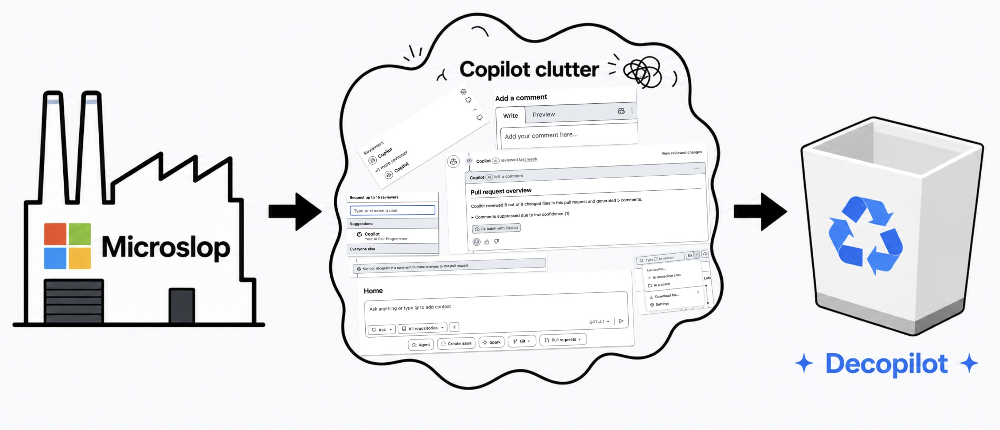

  

# Decopilot

Minimal Firefox extension for GitHub.

Nukes GitHub Copilot UI because it yaps too much 🗣️ and has bad aura 👁️_👁️

## What it nukes 💣

Decopilot nukes GitHub Copilot related UI, including:

1. Copilot buttons in the GitHub header.
2. Copilot dropdown menu entries.
3. Copilot settings links.
4. Copilot reviewer suggestions in pull requests.
5. Copilot comment editor buttons.
6. `@copilot` mention suggestions.
7. Pull request banners asking you to mention Copilot.
8. Copilot entries in GitHub navigation.
9. Copilot agent UI.
10. Empty leftover containers after Copilot gets yeeted.

It also watches the page after load, so newly inserted Copilot UI gets nuked too.

## Install 🧩

1. Open Firefox.
2. Go to `about:debugging#/runtime/this-firefox`.
3. Click `Load Temporary Add-on...`.
4. Select `manifest.json` from this folder.

> [!NOTE]
> Firefox removes temporary add-ons when the browser restarts.

## Scope 🎯

Decopilot only targets `github.com`.

It does not disable GitHub Copilot on your account. It only removes Copilot related UI from the page.

## Credit 🪦

Implemented with help from the opp.
